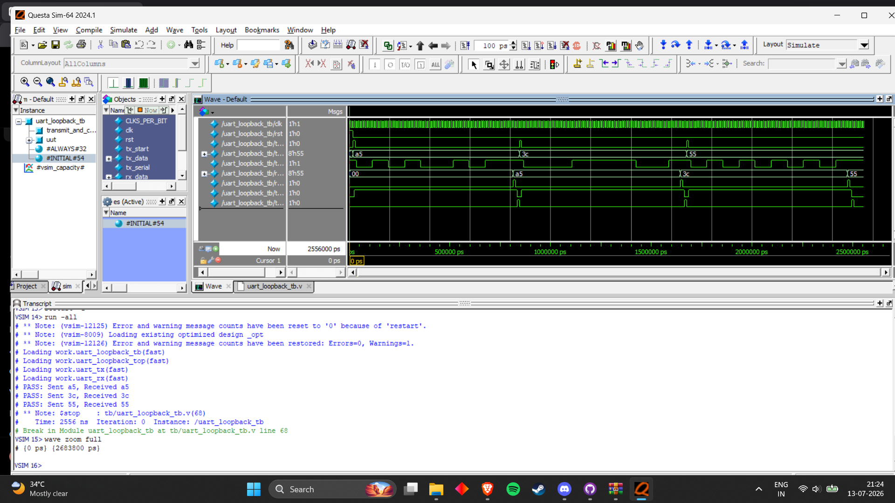

# UART Verilog Core

<p align="center">
  
</p>

A UART transmitter and receiver core implemented in Verilog HDL with baud-rate generation, loopback verification, and QuestaSim-based simulation.

---

## Overview

This project implements a Universal Asynchronous Receiver/Transmitter (UART) communication core in Verilog HDL.

The design includes independent UART transmitter and receiver modules, a baud-rate tick generator, and a loopback top module used to verify end-to-end serial data transmission.

---

## Features

- UART transmitter
- UART receiver
- Baud-rate tick generator
- UART loopback integration
- Modular Verilog RTL design
- Dedicated testbenches
- QuestaSim simulation support
- Waveform-based verification

---

## Project Structure

```text
uart-verilog-core/

src/
    baud_tick_gen.v
    uart_tx.v
    uart_rx.v
    uart_loopback_top.v

tb/
    uart_tx_tb.v
    uart_rx_tb.v
    uart_loopback_tb.v

sim/
    run_questa.do

docs/
    architecture.md
    Uart-wave.png

README.md
.gitignore
LICENSE